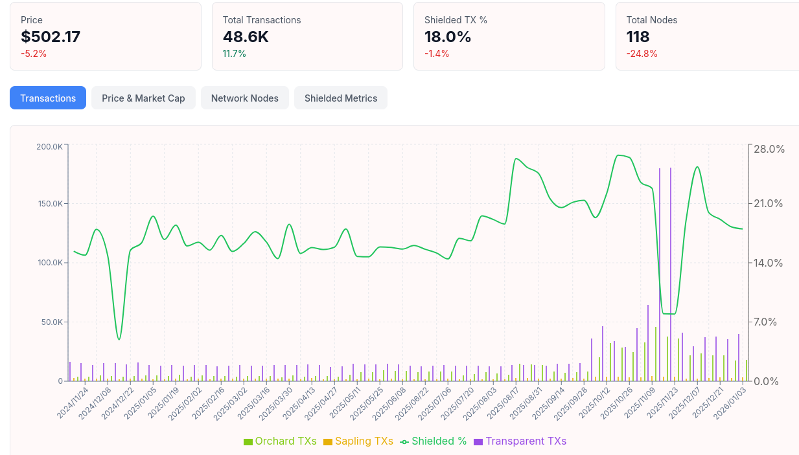

+++
title = "Debunking Arkham's Zcash Claims"
date = 2026-01-06T10:24:58Z
draft = false
+++

Last month, blockchain surveillance company [Arkham announced that they're able to trace 53% of ZCash transactions](https://nitter.poast.org/arkham/status/1998122628390048174).
As expected, the claim was framed for maximum impact. And just as quickly, the community [pushed back](https://nitter.poast.org/mert/status/1998290659284042123) and [called it out](https://nitter.poast.org/vinibarbosabr/status/1998325143966294436) for what it really was: marketing spin bordering on misinformation.

So why is this claim fundamentally misleading?

## Understanding ZCash’s Pools

ZCash supports four value pools: one transparent pool and three shielded pools. The transparent pool behaves much like Bitcoin: balances and transfers are publicly visible, and surveillance is trivial. The three shielded pools (Sprout, Sapling, and Orchard) are where ZCash’s privacy guarantees actually live.

The most important of these today is Orchard, which leverages the modern [Halo 2 proof system](https://zechub.wiki/zcash-tech/halo). Transactions within Orchard provide strong sender, receiver, and amount privacy. In practical terms, ZCash has already achieved what Monero is still working toward with its proposed [Full Chain Membership Proofs](https://www.getmonero.org/2024/04/27/fcmps.html): unlinkability between transactions inside the shielded pool.

Put simply, once funds are inside Orchard, transactions cannot be tied to one another. The information required to do so does not exist on-chain.

## Where Partial Visibility Comes From

Of course, users sometimes move funds between the transparent pool (T) and shielded pools (Z). These cross-pool transactions leak *some* structural information and are typically referred to as:

- **Shielding** (T → Z)
- **Deshielding** (Z → T)

These transactions reveal that value entered or exited a shielded pool, but crucially, they say nothing about what happens *inside* the shielded pool itself. All shielded-to-shielded (Z → Z) activity retains strong privacy guarantees.

This distinction is exactly where Arkham’s announcement fell apart.

After ZCash founder Zooko Wilcox responded publicly, Arkham quietly walked back the implication that shielded transactions were being traced. In their own words, [they admitted](https://nitter.poast.org/arkham/status/1998402808622805384):
> Yes, your z->z transactions are not accounted for in the 50% of Zcash transactions labeled. That's why there's another 50% left.

In other words: the most privacy-critical transactions were never part of Arkham’s claim to begin with. The headline did the work, the clarification came later - a familiar pattern that fits neatly alongside Arkham’s broader track record of questionable business practices, including initiatives like their [Snitch to Earn program](https://nitter.poast.org/arkham/status/1678339355314900992).

## Stats

Even Arkham’s visibility into the transparent side of ZCash is often overstated. A natural follow-up question is: how much ZCash activity actually touches shielded pools at all?

ZechHub provides some useful data here:

With some outliers aside, roughly 18% of ZCash transactions involve shielded pools. This already limits the scope of any surveillance narrative. More importantly, *within* that subset, shielded-to-shielded activity remains opaque by design.

So while Arkham can label and speculate about transparent activity (something nobody ever disputed) they remain blind where ZCash’s privacy properties actually matter.

## Is ZCash safe?

If your definition of "safe" includes strong on-chain privacy guarantees against blockchain surveillance firms, then the answer hasn’t changed. Arkham did not break ZCash. They did not deanonymize shielded transactions. They simply repackaged visibility into transparent activity as something far more dramatic.

The real takeaway is not about ZCash's weaknesses, but about how aggressively surveillance companies will blur technical realities to generate attention.

