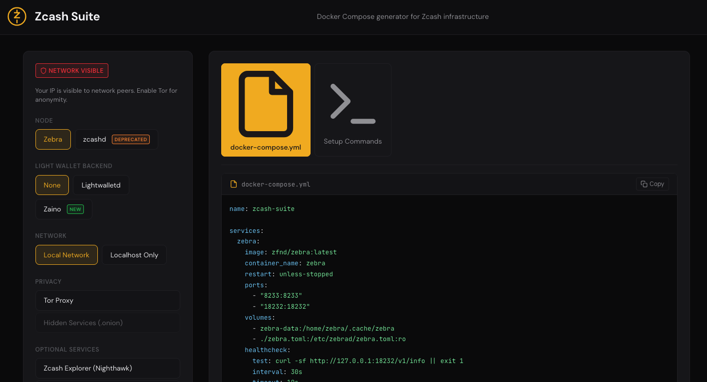

+++
title = "Building Zcash Suite: Making Privacy Infrastructure Accessible"
date = 2026-01-12T19:14:23Z
draft = false
+++

Here is an uncomfortable reality: **the people who benefit most from financial privacy are often the least able to deploy it properly.**

Running your own Zcash node is the privacy baseline. The moment you rely on third party infrastructure, metadata can leak. IP addresses, wallet queries, timing correlations, and usage patterns all become visible. For journalists, activists, or anyone operating under financial scrutiny, this metadata can be as sensitive as the transactions themselves.

The problem is that modern privacy infrastructure is not simple to run.

Getting a Zcash stack online today usually means dealing with:

- Docker and docker-compose setup
- Network layout and exposed ports
- Deciding between [Zebra](https://github.com/ZcashFoundation/zebra) and the soon to be [retired zcashd](https://z.cash/support/zcashd-deprecation/)
- Understanding Lightwalletd versus the newer [Zaino](https://github.com/zingolabs/zaino) indexer
- Configuring Tor for outbound traffic and hidden services
- Monitoring, health checks, and update automation

That is hours of work before a single block finishes syncing.

**Privacy is effectively gated behind DevOps experience.** This project exists to remove that barrier.

---

## The Idea

The concept itself is straightforward and borrowed from something that already works. [Monero Suite](https://monerosuite.org/) does this well for Monero. You answer a few questions in a browser and receive a production ready `docker-compose.yml` tailored to your needs.

Zcash deserves the same treatment.

- Which node to run? Zebra by default, since zcashd is on its way out.
- Light wallet support? So wallets like Zashi or YWallet can connect.
- How private should it be? Tor proxying, hidden services, or both.
- Extra services? Monitoring, automatic updates, utilities.

Click, copy, deploy. No hunting through outdated documentation. No guessing which GitHub gist is still relevant.

Here is the current state of the project:

It is still in development, but the tool will generate valid docker-compose files using Zebra, Lightwalletd or Zaino, optional Tor integration, and a small set of supporting services.

---

## Why This Moment Matters

Several things are converging.

**The retirement of zcashd.** The original C++ node has sunset in 2025. So most users will be migrating to Zebra anyway, which makes this a good time to help people start with clean and correct setups.

**The emergence of the Z3 stack.** Zebra, Zaino, and Zallet form a new architecture for Zcash. Zaino in particular brings a modern Rust indexer with Orchard support and features that Lightwalletd never offered. Lowering the barrier to experimenting with this stack is valuable.

**Growing pressure on privacy.** Blockchain surveillance is no longer niche. It is a multi billion dollar industry. Running your own infrastructure is no longer extreme caution. It is basic operational security.

---

## Directions Under Consideration

The scope is intentionally limited for now, but a few ideas are being explored.

**Testnet support.** A simple toggle to switch between mainnet and testnet configurations. Useful for developers or anyone experimenting without real funds.

**Alternative deployment targets.** Today the output is docker-compose. The same logic could generate configs for Umbrel, Start9, bare metal scripts, or other environments.

**Privacy indicators.** A lightweight signal showing how private a given configuration is, based on enabled options. Not judgmental, just informative.

**zebra.toml generation.** At the moment, Zebra configuration is handled separately. Generating it alongside docker-compose would make the setup more complete.

**Community presets.** Opinionated bundles like personal node, family server, or activist toolkit that provide sensible defaults for common scenarios.

**Update visibility.** Some way to surface new Zebra or Zaino releases so setups do not quietly fall behind.

These are ideas, not commitments. Building in public means being explicit about what is exploratory.

---

## Design Principles

**No servers and no trust assumptions.** Everything runs entirely in the browser. There is no backend. Configuration choices never leave the user’s machine.

**Opinionated but explicit.** Zebra over zcashd and Tor by default are recommendations, not hidden constraints. Tradeoffs are visible and users stay in control.

**Learning through use.** The goal is not just to generate files, but to leave users with a clearer understanding of how their infrastructure works.

---

## The Bet

The underlying belief is simple: **privacy infrastructure should feel as approachable as installing an app.**

Not because the problems are trivial, but because the hard parts can be solved once and reused. Experts do the heavy lifting. Everyone else benefits from the result.

